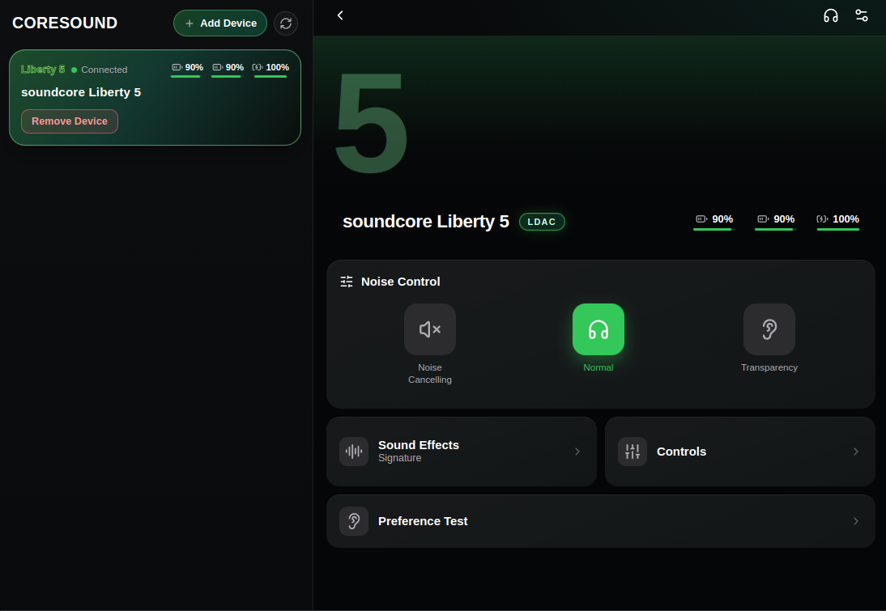

# CoreSound

<table><tr>
<td></td>
<td align="right">

[](https://github.com/CriticalRange/CoreSound/releases/latest)
[](https://github.com/CriticalRange/CoreSound/commits/main)
[](LICENSE)
[]()

</td>
</tr></table>

CoreSound is an open-source desktop companion app for Soundcore/Anker Bluetooth audio devices on Linux and Windows. It communicates over BR/EDR RFCOMM using a reverse-engineered protocol, giving you control over ANC modes, EQ presets, and device settings without the official mobile app.



## Features

- Bluetooth device scan and connect via BlueZ D-Bus on Linux
- ANC mode control (Normal, Transparency, ANC) with scene and wind noise options
- EQ preset selection and custom EQ band editing
- Battery level monitoring
- Multipoint connection support
- Device capability detection per model
- Local settings persistence

## Requirements

- Node.js 20+
- Linux with BlueZ (for full functionality) or Windows 10+
- A compatible Soundcore/Anker device paired to your system

## Run from source

```bash
npm install
npm start
```

## Build

```bash
npm run dist:linux   # produces AppImage (x64)
npm run dist:win     # produces zip (x64)
```

## How it works

CoreSound connects to paired Bluetooth devices over RFCOMM (BR/EDR), probing the control channel to establish a session. Commands are built as binary frames following the device protocol and written directly to the RFCOMM socket. Responses are parsed to extract battery levels, mode state, and device info.

On Linux, device discovery and connection management go through BlueZ via D-Bus using `dbus-next`. On Windows, the OS Bluetooth stack handles pairing; CoreSound takes over once the RFCOMM channel is available.

## Project structure

```
src/
  main.js                        Electron main process, IPC handlers
  preload.js                     Renderer bridge (window.coresound API)
  bluez-backend.js               BlueZ D-Bus backend, scan/connect logic
  soundcore-protocol.js          RFCOMM protocol — frame parser and command builders
  eq-presets.js                  EQ preset definitions
  rfcomm-helper.py               Python helper for raw RFCOMM on Linux
  renderer/
    renderer.js                  App state and UI logic
    index.html                   UI layout
    styles.css                   Theme and styling
    eq-presets-data.js           EQ preset data for the renderer
    device-capabilities.js       Per-model feature flags
    device-name-aliases.js       Bluetooth name to model code mappings
    device-image-manifest.js     Device image paths by model code
    apk-code-name-map.js         Model code to product name mappings
    assets/                      App icons (Linux and Windows)
    device-images/               Product images per model
```

## Device support

Devices are matched by their Bluetooth advertised name. Model capabilities (ANC, LDAC, wind noise detection, etc.) are defined per model code in `device-capabilities.js`. If your device connects but features are missing or incorrect, the capability map likely needs an entry for your model.

## Name resolution

Some devices advertise without a local name and appear as "Unnamed Device". CoreSound resolves the name for the active connected device by reading the GAP Device Name characteristic (`0x1800` / `0x2A00`). No background connections are made to other nearby devices.

## Windows notes

- The device must be paired via Windows Bluetooth settings before CoreSound can connect.
- Some devices only expose the control channel after OS-level pairing is complete.
- Bluetooth must be enabled and the device must be powered on and in range.

## License

GPL-3.0-only. See [LICENSE](LICENSE).
